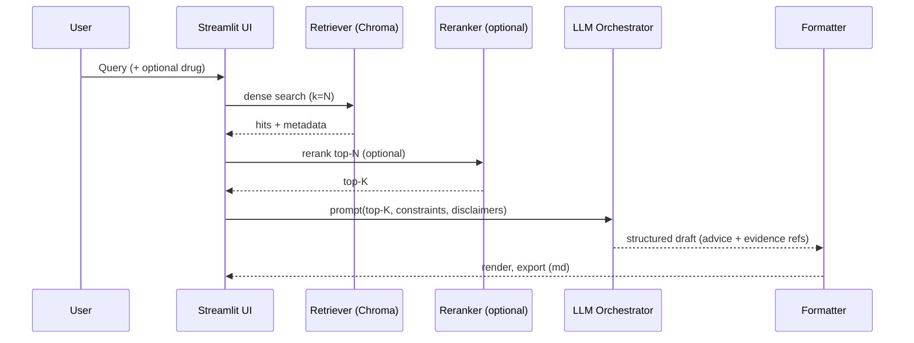

# CareMind · Streamlit — System Architecture

> Version: 2025‑09‑27 · Owner: Samuel Huang · Repo: `caremind-streamlit`

---

## 1) Purpose & Scope
CareMind is a Retrieval‑Augmented Generation (RAG) prototype for clinical decision support. It combines structured drug data and unstructured clinical guidelines to generate suggestion drafts with transparent evidence and citations. This document describes the end‑to‑end architecture, runtime data flow, environments, configuration, and extension points.

**Goals**
- Fast, explainable answers with cited evidence
- Reproducible ingestion and retrieval pipeline
- GPU‑accelerated embeddings (optional) and local/offline friendly vector store
- Deployable locally and on Streamlit Community Cloud

**Non‑Goals**
- Not a medical device; outputs are drafts for clinician review
- Not a full EMR/EHR integration

---

## 2) High‑Level Architecture (Conceptual)

```mermaid
flowchart LR
  subgraph Ingestion
    A[Guidelines PDFs/JSONL] -->|parse & chunk| B[Chunker]
    B --> C[Embedder (Sentence-Transformers)]
    C --> D[(ChromaDB Collection)]
    A2[Drug/Regulatory Data (CSV/JSON)] --> E[Normalizer]
    E --> F[(SQLite: drugs.sqlite)]
  end

  subgraph Runtime (App)
    G[Streamlit UI]
    H[Retriever (Chroma)]
    I[Reranker (optional)]
    J[LLM Orchestrator]
    K[Formatter + Citation Builder]
  end

  D -. vector search .-> H
  F -. lookup .-> J
  G -->|question & optional drug| H --> I --> J --> K --> G
```

**Key components**
- **Ingestion**: Parses guidelines into chunks, computes embeddings, writes to a **ChromaDB** collection. Normalizes optional drug data into **SQLite**.
- **Runtime**: Streamlit app drives retrieval → (optional) rerank → LLM‑facilitated suggestion draft → formatted citations + export.

---

## 3) Repos, Folders & Major Modules

```
caremind-streamlit/
├─ app.py                        # Streamlit UI + orchestration
├─ rag/
│  ├─ retriever.py              # Vector search, hybrid filters, health checks
│  ├─ pipeline.py               # End-to-end answer() pipeline
│  └─ prompts/
│     └─ suggestion_prompt.txt  # Structured prompt template (optional)
├─ ingest/
│  ├─ create_db.py              # Build/repair Chroma collection
│  └─ parse_guidelines.py       # PDF → JSONL (parsed chunks)
├─ data/
│  ├─ guidelines.parsed.jsonl   # Parsed guideline chunks (generated)
│  └─ drugs.sqlite              # Structured drug tables (optional)
├─ chroma_store/                # Chroma persistent dir (generated)
├─ .env.example                 # Required/optional env vars
├─ requirements.txt             # Pinned libs for local
├─ .devcontainer/               # Devcontainer (optional)
└─ README.md / ARCHITECTURE.md  # Docs
```

---

## 4) Configuration & Environment Variables

**Required**
- `CHROMA_PERSIST_DIR` — absolute/relative path to Chroma store (e.g., `./chroma_store`)
- `CHROMA_COLLECTION` — collection name (e.g., `guideline_chunks_1024_v2`)
- `EMBEDDING_MODEL` — HuggingFace model id (e.g., `BAAI/bge-large-zh-v1.5` or a small model for CPU)

**Optional**
- `OPENAI_API_KEY` — required only if using OpenAI LLMs
- `HUGGINGFACEHUB_API_TOKEN` — required only for gated models
- `DEVICE` — `cuda` | `cpu` override for embeddings
- `RERANKER_MODEL` — e.g., `BAAI/bge-reranker-large`
- `MAX_CHUNK_TOKENS`, `TOP_K` — tuning knobs for retriever

> Each developer may keep a private `.env`; do not commit secrets. Provide `.env.example` with required vs optional clearly marked.

---

## 5) Data Model

**Guideline Chunk** (stored in Chroma)
```json
{
  "doc_id": "<source id>",
  "section": "<heading path>",
  "text": "<chunk text>",
  "lang": "zh|en",
  "page": 12,
  "tags": ["asthma", "beta-blocker"]
}
```

**Drug Record** (stored in SQLite)
```sql
CREATE TABLE drugs (
  id TEXT PRIMARY KEY,
  name TEXT,
  atc_code TEXT,
  contraindications TEXT,
  interactions TEXT
);
```

---

## 6) Ingestion Pipeline

### 6.1 Parse → Chunk → Clean
- PDF → text extraction with fallbacks; structure headings/sections
- Chunk by section/length; preserve page refs for citations
- Normalize language tags (ZH/EN), remove boilerplate

### 6.2 Embedding & Upsert (GPU‑optional)
- Load `EMBEDDING_MODEL` via Sentence‑Transformers
- Batch encode (e.g., 32–128) → upsert to `CHROMA_COLLECTION`
- Store metadata for source tracing & filters

### 6.3 Quarantine & Self‑Repair (on conflict)
- If a collection exists but is incompatible, quarantine the old store and rebuild transparently
- Log health lines during app start (see §9)

**Command (example)**
```bash
export CHROMA_PERSIST_DIR=./chroma_store
export CHROMA_COLLECTION=guideline_chunks_1024_v2
export EMBEDDING_MODEL=BAAI/bge-large-zh-v1.5

python ingest/create_db.py \
  --in data/guidelines.parsed.jsonl \
  --persist-dir "$CHROMA_PERSIST_DIR" \
  --collection "$CHROMA_COLLECTION"
```

---

## 7) Runtime Retrieval & Generation



**Retriever (rag/retriever.py)**
- Opens Chroma collection from `CHROMA_PERSIST_DIR` / `CHROMA_COLLECTION`
- Health checks on startup; prints versions and resolved paths
- Semantic search with metadata filters (language, section tags)
- Returns compact payload for UI + export

**Reranker (optional)**
- Cross‑encoder reranker for precision on top-K
- Disabled by default on CPU‑only env to keep latency acceptable

**LLM Orchestrator (rag/pipeline.py)**
- Deterministic, structured prompt template
- Assembles citations with page refs & section headers
- Enforces clinical disclaimer in output

---

## 8) Streamlit App (app.py)

**UI Regions**
- Inputs: clinical question, optional drug name, language switch, k, export buttons
- Panels: *Suggestions*, *Evidence snippets*, *Drug (structured)*, *Run log*
- Buttons: Export Advice (.md), Export Evidence (.md) — compact layout, disabled when empty

**State & Error Handling**
- Graceful empty‑state behavior (no empty exports)
- Clear error toasts for missing collection or device issues

---

## 9) Observability & Health Checks

On startup, the app prints lines similar to:
```
Chroma version: <x.y.z>
CHROMA_PERSIST_DIR: <resolved path>
CHROMA_COLLECTION: <name>
Quarantined old Chroma store ... / Collection opened after quarantine+rebuild.
```

Additional logs:
- Embedding device: `cuda`/`cpu` and model id
- Number of loaded chunks and last build time
- Reranker status (enabled/disabled)

---

## 10) Environments

**Local (WSL/Windows 11 + RTX 4070)**
- Python 3.10+ venv/conda
- GPU embeddings optional; ensure CUDA/cuDNN aligned with PyTorch build

**Streamlit Community Cloud**
- CPU‑only; avoid heavyweight models; use smaller embedding models if rebuilding in‑cloud
- Dependency pinning: avoid `pysqlite3-binary` versions incompatible with platform python; prefer system sqlite unless required
- On first run: ingestion may quarantine and rebuild the collection; logs will show progress

---

## 11) Performance & Tuning
- **Embedding model**: choose `bge-small-zh` on CPU; `bge-large-zh` on GPU
- **Batch size**: 32–128 for embeddings; monitor VRAM/CPU RAM
- **TOP_K**: 5–8 is typical; higher k improves recall but increases LLM token cost
- **Chunking**: prefer semantic boundaries over fixed windows; cap ~800–1200 tokens/chunk
- **Reranker**: enable only when latency budget allows; significant precision gains on noisy corpora

---

## 12) Security, Privacy, Compliance
- No PHI/PII ingestion; use public guidelines only
- Keep API keys out of repo; use `.env` locally and Streamlit Secrets in cloud
- Add explicit clinical disclaimer in every suggestion

---

## 13) Failure Modes & Safeguards
- **Collection missing** → UI shows setup hints; disable export buttons
- **Model load failure** (meta device) → suggest smaller model or CPU fallback
- **SQLite unavailable** → degrade gracefully; hide structured drug panel
- **Long‑running ingestion** → resume from checkpoint; quarantine old store

---

## 14) Extension Points (Roadmap)
- Hybrid retrieval (BM25 + dense) for better recall
- Domain‑specific rerankers and safety filters
- Multi‑lingual prompts; per‑section summarization
- Eval harness: retrieval precision@k, answer faithfulness, citation accuracy
- Packaging: Dockerfile & devcontainer for reproducible dev

---

## 15) Quickstart (End‑to‑End)

```bash
# 1) Configure
cp .env.example .env  # fill required vars

# 2) Ingest (once or when data changes)
python ingest/create_db.py --in data/guidelines.parsed.jsonl \
  --persist-dir "$CHROMA_PERSIST_DIR" \
  --collection "$CHROMA_COLLECTION"

# 3) Run app
streamlit run app.py
```

---

## 16) Appendix — Interfaces

**Retriever API (excerpt)**
```python
search_guidelines(question: str, k: int = 8, lang: str | None = None) -> list[dict]
```
Returns: `[ {"text": str, "doc_id": str, "section": str, "page": int, "score": float} ]`

**Pipeline API (excerpt)**
```python
answer(question: str, drug_name: str | None, k: int, lang: str) -> dict
```
Returns: `{ "advice_md": str, "evidence_md": str, "hits": [...], "log": str }`

